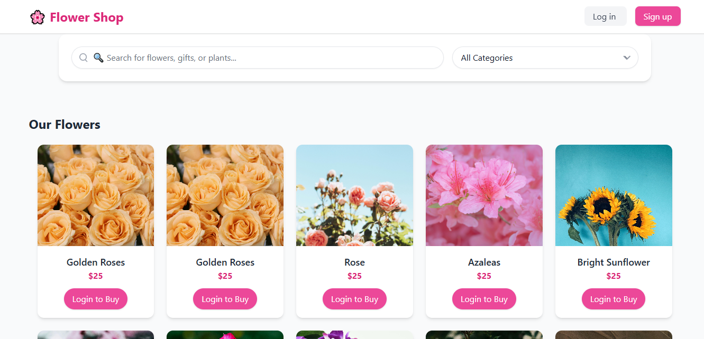

# 🌸 Floriq - Flower ERP

Floriq is a modern **Enterprise Resource Planning (ERP)** system built with **Laravel** for managing flower businesses.  
It streamlines customer orders, employee management, and admin operations in one elegant system.  

🚀 **Live Demo:** [Floriq on Railway](https://flowererp-production.up.railway.app/)

---

## 🔑 Demo Credentials

You can explore the system with different roles:

### 👤 Customer Login
- **Email:** `userone@gmail.com`  
- **Password:** `userone1234`

### 👩 Employee Login
- **Email:** `jane@example.com`  
- **Password:** `password123`

### 👨‍💼 Admin Login
- **Email:** `admin@example.com`  
- **Password:** `password123`

---

## 🖼️ Screenshot

---

## 🛠️ Features
- 🌸 Customer order management  
- 👩 Employee dashboard & workflow tools  
- 👨‍💼 Admin controls for users, products, and reporting  
- 📊 Data-driven insights for flower businesses  
- 💻 Responsive and user-friendly UI  

---

## ⚙️ Running Locally (Laravel Setup)

Follow these steps to set up **Floriq** on your local machine:

### 1️⃣ Clone the repository
git clone https://github.com/your-username/flowerErp.git
cd flowerErp

### 2️⃣ Install dependencies
composer install
npm install && npm run dev

### 3️⃣ Set up environment file
cp .env.example .env

### 4️⃣ Generate application key
php artisan key:generate

### 5️⃣ Run database migrations & seeders
php artisan serve

